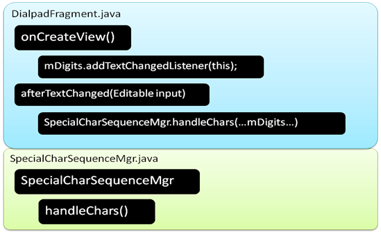
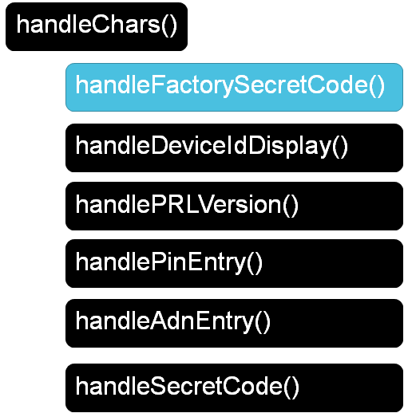
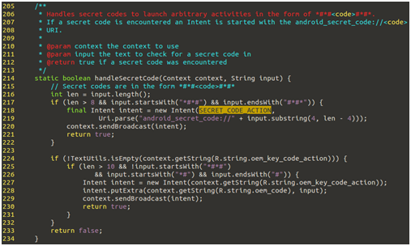
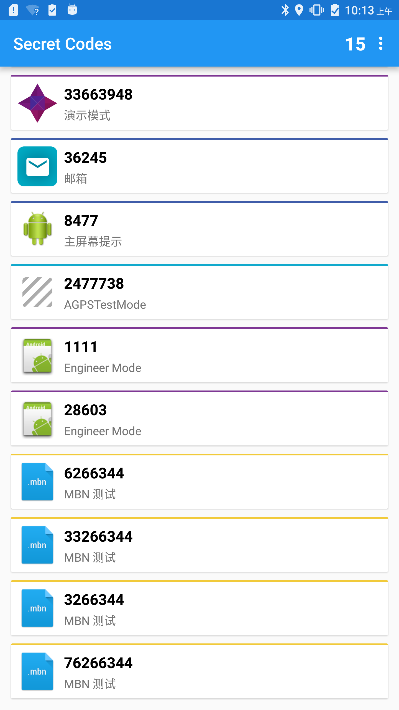
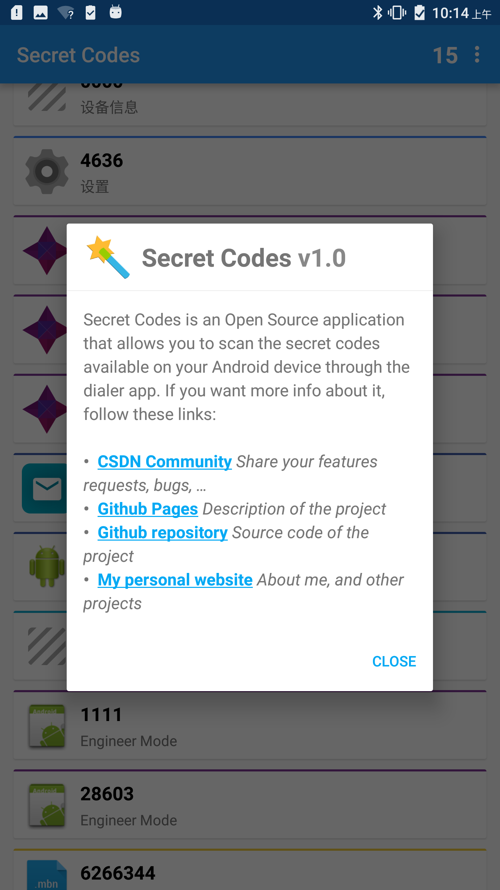

# AndroidSecretCode

# What's the android secret code?
In Android a secret code is defined by this pattern: ```*#*#<code>#*#*```

If such a secret code is executed, the system Dialer app will trigger this code:[AOSP Code](https://android.googlesource.com/platform/packages/apps/Dialer/+/91197049c458f07092b31501d2ed512180b13d58/src/com/android/dialer/SpecialCharSequenceMgr.java#131)


```
static private boolean handleSecretCode(Context context, String input) {
    int len = input.length();
    if (len > 8 && input.startsWith("*#*#") && input.endsWith("#*#*")) {
        Intent intent = new Intent(TelephonyIntents.SECRET_CODE_ACTION,
                Uri.parse("android_secret_code://" + input.substring(4, len - 4)));
        context.sendBroadcast(intent);
        return true;
    }

    return false;
}
```

# How to execute the secret code?
Directly through the dialer application of your Android device.
Simply write the secret code like: *#*#123456789#*#*.
There are two ways to execute a secret code:
## Broadcast the intent event
1. Using the intent-filter match rules
action phase : SECRET_CODE_ACTION
data scheme phase : android_secret_code
data host phase : input.substring()
```
string SECRET_CODE_ACTION = "android.provider.Telephony.SECRET_CODE"
final Intent intent = new Intent(SECRET_CODE_ACTION, 
        Uri.parse("andorid_secret_code://" + input.substring(4, len - 4)));
context.sendBroadcast(intent);
```
2. Using the extra data
action phase : oem_key_code_action
putExtra : extra input data
```
Intent intent = new Intent(context.getString(R.string.oem_key_code_action));
intent.putExtra(context.getString(R.string.oem_code), input);
context.sendBroadcast(intent)
```


## Start the activity directly
```
String secretCode = "123456789";
Intent intent = new Intent(Intent.ACTION_DIAL);    
intent.setData(Uri.parse("tel:*#*#" + secretCode + "#*#*"));
startActivity(intent);
```

# How to create your own secret code?
dd these lines in your AndroidManifest.xml
And whenever *#*#123456789#*#* is submitted, your receiver will be notified.

```
<receiver android:name=".MySecretCodeReceiver">
    <intent-filter>
        <action android:name="android.provider.Telephony.SECRET_CODE" />
        <data android:scheme="android_secret_code" android:host="123456789" />
	</intent-filter>
</receiver>
```

## Demo View




## Vedio Demo show in (./Resources/demo.mp4)
